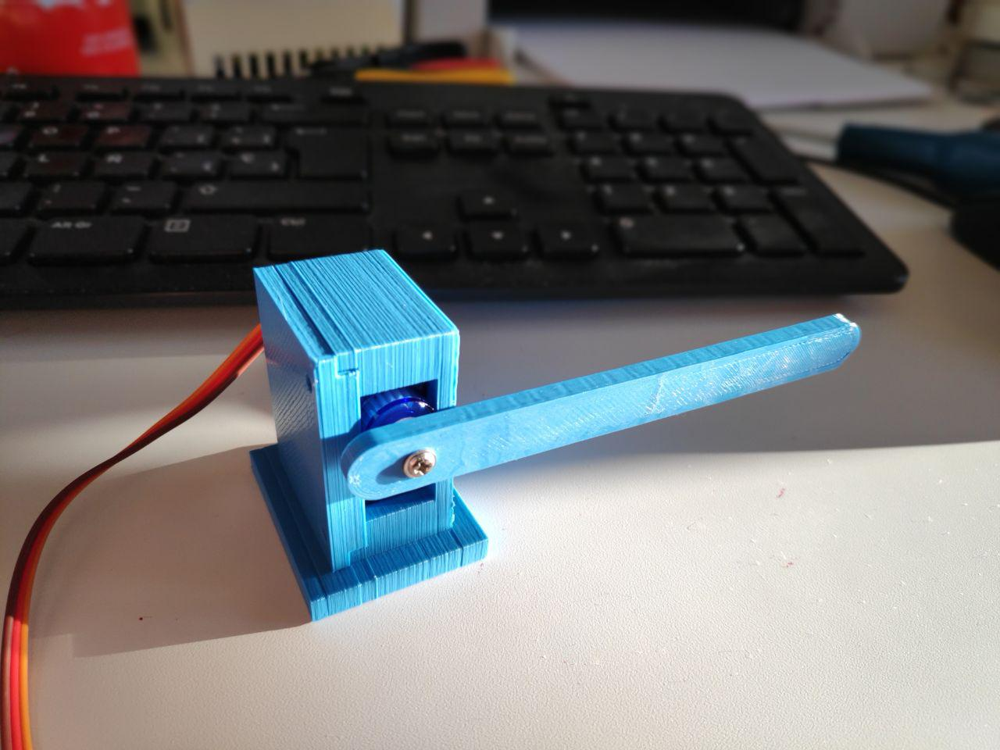

# Barrera y caja para microservo
Se trata de tres piezas que conforman una caja para el microservo, una tapa de la misma y la barrera en si.
Se ha realizado en un principio en *sketchup free* para que el alumnado pueda diseñarla y editarla.

También se ha realizado las tres piezas en [Freecad](freecad) para el alumnado más experimentado.

